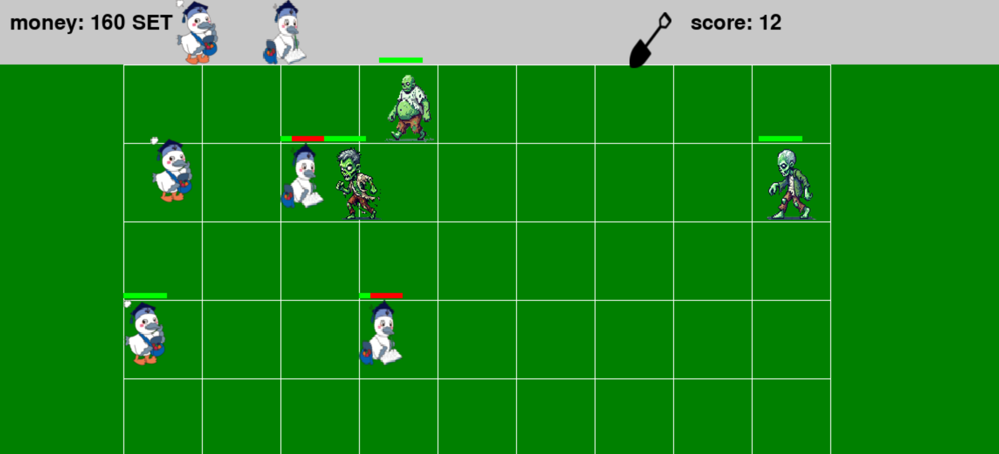

# こうかとんVSゾンビ

## 実行環境の必要条件
* python >= 3.10
* pygame >= 2.1

## ゲームの概要
* 進行してくるゾンビを、様々な「こうかとん」を配置して倒すタワーディフェンス型ゲームです。
## ゲームの遊び方

### 1. ゲーム開始
1. タイトル画面が表示されます。
2. Enterキーを押すと、ゲーム画面が表示されます。
3. 上部には「money（所持金）」が表示されます。このmoneyを使用して、こうかとんを配置します。
4. 画面右側にある「SET」エリアからこうかとんを選択します。

### 2. こうかとんを配置する
1. マウスで「SET」エリアのこうかとんをドラッグ＆ドロップします。
2. 配置したい場所までドラッグし、クリックを離すことでマスに配置されます。
3. こうかとんを配置すると、所持金（money）が減少します。所持金が足りない場合は配置できません。

### 3. ゾンビの進行を阻止する
1. ゾンビは画面右端から現れ、左方向へ進行してきます。
2. 配置されたこうかとんは一定間隔で弾を発射し、ゾンビにダメージを与えます。
3. 弾がゾンビに当たると、ゾンビのHPが減少します。ゾンビのHPが0になると、ゾンビは消滅します。

### 4. 衝突時の挙動
1. ゾンビがこうかとんに接触すると、こうかとんとゾンビは互いにダメージを与え合います。
2. こうかとんのHPが0になると破壊され、ゾンビは再び進行を再開します。
3. ゾンビが陣地の最左端に到達すると、ゲームオーバーとなります。

### 5. 所持金の増加
1. 時間が経過すると自動的にmoneyが増加します。
2. moneyを効率よく管理し、こうかとんを適切に配置してゾンビの進行を阻止しましょう。

### 6. ゲームオーバー条件
* ゾンビが陣地に侵入するとゲームオーバーになります。

---

## ゲームの実装

### 共通基本機能
* 背景画像の描画と敵、味方の出現
* ドラッグによって設置するこうかとんを選択する機能
* こうかとんが弾を発射するようにする機能
* 弾とゾンビの衝突によってダメージを与える機能
* ゾンビの出現数やタイミングを調整する機能
* 時間経過でmoneyを増加する機能
* ゾンビとこうかとんの衝突処理（攻撃状態、攻撃パラメータ、HPバー表示など）

### 分担追加機能
* 倒したゾンビに応じてスコアを増やす機能（担当：山本）
* タイトル、クリア、ゲームオーバー画面の表示（担当：飯田）：タイトル画面を表示し、Enterが押されるとゲーム開始。クリア、ゲームオーバー時に画面を切り替える
* ゾンビの種類の増加（担当：廣木）通常ゾンビ、足速ゾンビ、デブゾンビの３種類実装
* こうかとんの種類の増加（担当：池田）攻撃こうかとんと守りこうかとんの2種類実装
* スコップ機能の追加（担当：陳）スコップで無駄なこうかとんを消せる

---

### ToDo
- ゲームクリア画面
- 背景を優雅にしたかった
- 難易度の追加

### メモ
* 衝突判定には授業内で使ったアルゴリズムを使用
* こうかとんとゾンビには様々な種類がいる

